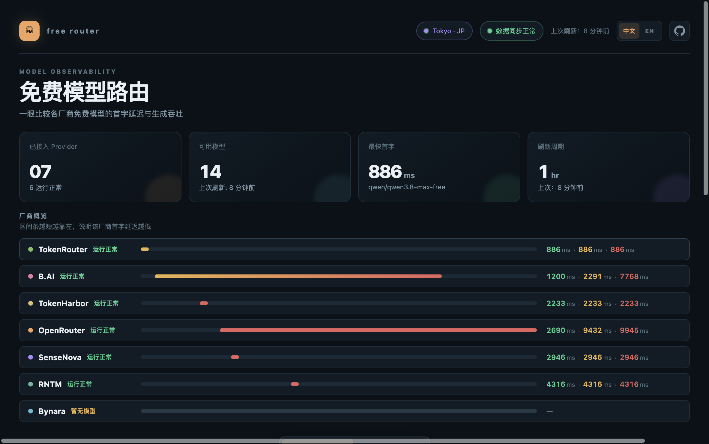

# Free Model Radar

运行在 Cloudflare Workers 上的模型可用性与延迟雷达。

[English](README.md)



## 厂商对比


| 厂商 | 使用机制 | 跳转 |
|------|----------|------|
| **Groq Cloud** | 无需签到；免费层按 RPM、RPD、TPM、TPD 限制，不是固定月度赠送额度。[速率限制](https://console.groq.com/docs/rate-limits) | [控制台](https://console.groq.com) |
| **OpenRouter** | 无需签到；免费模型通常每天 50 次请求，累计购买至少 $10 额度后提高到约 1000 次/天。[FAQ](https://openrouter.ai/docs/faq) | [官网](https://openrouter.ai) |
| **RNTM** | 无需签到，按量付费；新工作区可能包含 $5 免费额度，另一个 Starter 活动说明其额度 7 天后过期。[Quickstart](https://rntm.sh/docs/quickstart) · [Starter 活动](https://rntm.sh/offer) | [官网](https://rntm.sh) |
| **NVIDIA NIM** | 无需签到；Free Endpoint 有速率限制，未找到统一公开的固定日/月额度。[模型目录](https://build.nvidia.com/models) | [模型中心](https://build.nvidia.com/models) |
| **B.AI** | 无需签到；官方文档说明部分模型当前免费，使用量按 Token/积分计算。[计费与用量](https://docs.b.ai/zh-Hans/llmservice/pricing-and-usage/) | [注册](https://chat.b.ai/chat?invite_code=ATZT6T) |
| **GMI Cloud** | 无需签到；部分模型由目录标记为免费，但未找到统一公开的固定日/月额度。[计费说明](https://docs.gmicloud.ai/inference-engine/billing/price) | [控制台](https://console.gmicloud.ai) |
| **SenseNova** | 未发现公开统一的签到或月度额度规则，具体以平台当前账户政策为准 | [官网](https://www.sensenova.cn) |
| **ZenMux** | 无需签到；Free 计划约 5 次 Flow/5 小时，仅支持 Studio Chat、不提供 API；API 需要 Starter 及以上订阅。[订阅说明](https://zenmux.ai/docs/guide/subscription.html) | [注册](https://zenmux.ai/invite/DZSANY) |
| **JustWoker** | 第三方公开资料显示为注册额度 + 每日签到额度，具体金额需在站内复核。[第三方资料](https://github.com/panxunying/ai-coding-welfare) | [注册](https://api.justwoker.icu/register?aff=BHmu) |
| **GoRouter** | 第三方资料显示存在每日签到，但额度未确认。[第三方资料](https://github.com/panxunying/ai-coding-welfare) | [注册](https://gorouter.app/sign-up?aff=4q8W) |
| **AIHubMix** | 无需签到；免费模型说明为无需信用卡、无试用到期时间，但按模型设置 RPM 和每日 Token 上限，每日重置。[免费模型说明](https://docs.aihubmix.com/en/blogs/free-ai-models) | [官网](https://aihubmix.com/?aff=FqPM) |
| **AMD Radeon Cloud** | 需要 AMD 开发者账号和 API key。当前目录返回 `free: false` 且价格为正；将目标模型视为免费前，应以当前账号的访问策略为准。 | [Radeon Cloud](https://developer.amd.com.cn/radeon) |
| **Bynara** | 无需签到；免费层包含每分钟请求限制和每日 Token 配额，通常按 UTC 每日重置。[文档](https://router.bynara.id/docs) | [官网](https://router.bynara.id) |
| **OpenCode ZEN** | 无需签到；免费模型属于限时开放，需登录并补充计费信息，其他模型按请求计费。[ZEN 文档](https://dev.opencode.ai/docs/zen/) | [官网](https://opencode.ai) |
| **Token Harbor** | 无需签到；免费额度按滚动 7 天周期、按价值计量；无注册赠金，无需信用卡。[FAQ](https://tokenharbor.ai/faq) | [官网](https://tokenharbor.ai) |

> 免费模型、额度和账户要求可能随时变化。

## 本地准备

```bash
npm install
cp config/providers.example.json config/providers.local.json
cp .env.example .env.local
```

编辑：

```text
config/providers.local.json
.env.local
```

## Provider 配置

真实配置文件不提交 Git：

```text
config/providers.local.json
```

示例：

```json
{
  "version": 1,
  "updatedAt": "2026-08-27T09:00:00.000Z",
  "providers": [
    {
      "id": "provider-a",
      "name": "Provider A",
      "baseUrl": "https://api.example.com/v1",
      "secretName": "PROVIDER_A_KEY",
      "enabled": true,
      "modelStrategy": "free-first",
      "freeKeywords": ["free", ":free"],
      "probe": {
        "maxModels": 20,
        "concurrency": 3,
        "attempts": 1,
        "timeoutMs": 25000
      }
    }
  ]
}
```

校验配置：

```bash
npm run kv:validate
```

推送配置到 KV：

```bash
npm run kv:push
```

从 KV 拉取配置：

```bash
npm run kv:pull
```

## Cloudflare Secrets

```bash
npx wrangler secret put REFRESH_ADMIN_TOKEN
npx wrangler secret put PROVIDER_A_KEY
```

## KV

`wrangler.jsonc` 中需要替换真实 KV Namespace ID：

```jsonc
{
  "kv_namespaces": [
    {
      "binding": "RADAR_KV",
      "id": "replace-with-kv-namespace-id"
    }
  ]
}
```

## 开发命令

```bash
npm run dev
npm test
npm run typecheck
npm run build
npm run preview
npm run deploy
```

## 管理员入口

访问：

```text
/?admin_token=你的 REFRESH_ADMIN_TOKEN
```

验证成功后会设置 `HttpOnly` Cookie，有效期 12 小时，并重定向到 `/`。

## TODO

- [x] **趋势图**：增加近 7 天窗口内每个模型的吞吐量、首字延迟（TTFT）、端到端延迟趋势图；累计到 2 天数据即可展示走势，便于观察模型性能随时间的变化。
- [x] **Agent 配置导出**：新增「Agent 配置」页，导出各大 Agent 的模型配置信息，仅支持复制（不提供下载）。可复制当前免费模型的 ID，以及对应 Agent（Claude Code、Codex、OpenCode、Gemini CLI、Zed、Cursor）配置文件的格式。配置模板见 [`docs/agent-config-formats.md`](docs/agent-config-formats.md)。

## 趋势数据存储

趋势数据继续使用 Cloudflare KV，不引入 D1。刷新任务完成后会按天追加原始采样：

```text
trend:YYYY-MM-DD
```

每条采样记录包含 `providerId`、`providerName`、`modelId`、`checkedAt`、`status`、`ttftMs`、`tokensPerSec`、`latencyMs`。失败、不可用或缺失记录会保留 `status`，指标值使用 `null`，用于计算成功率并在趋势图中显示断点/失败点。

前端读取近 7 天 bucket 后在服务端聚合平均值、中位数、P95 和成功率；当至少存在 2 个采样日期时展示趋势图。KV 中只保存原始数据，避免派生统计写死。

## 注意事项

当前项目使用 OpenNext Cloudflare 适配器：

```bash
npm run build
npm run preview
npm run deploy
```

Cron 的业务入口在 `src/worker.ts`，其 `scheduled()` 会调用同一套 `runRefresh()`。实际部署前需要确认 OpenNext 生成的 Worker 是否已合并 `scheduled()` handler；如果没有，应使用单独 Cron Worker 绑定同一个 KV/Secrets 来运行 `src/worker.ts`。当前尚未执行真实 Cloudflare 部署冒烟测试。
