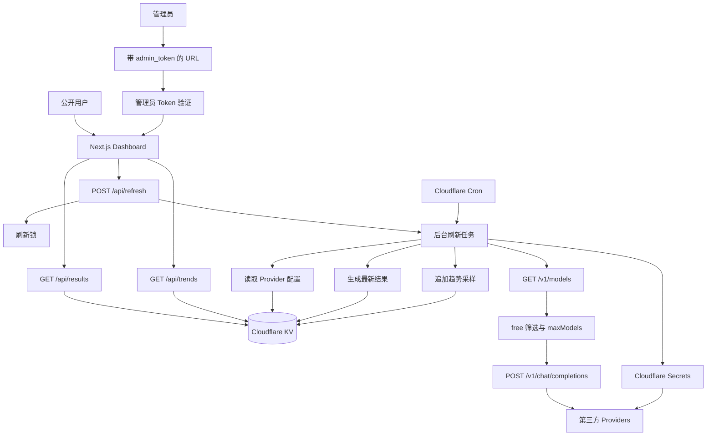

# Free Model Radar 设计存档

日期：2026-08-27

## 1. 项目定位

`Free Model Radar` 是一个部署在 Cloudflare Workers 上的模型可用性与延迟雷达。

目标：

- 自动发现各 Provider 的模型；
- 优先探测名称中带 `free` / `:free` 等关键词的模型；
- 没有 free 命名模型时，完整探测当前发现到的全部模型；
- 通过真实 `chat/completions` 请求验证模型是否可用；
- 记录延迟、免费状态、Token 消耗；
- 使用 Cloudflare Cron 定时刷新；
- 使用 Cloudflare KV 存储配置、结果、刷新状态、模型健康状态和近 7 天趋势采样；
- 使用 Cloudflare Secrets 保存 API Key 和管理员 Token；
- 不依赖服务器本地文件系统、VPS、Docker、Redis 或数据库服务器。

第一阶段用于公开查看模型可用性和延迟排行，解决 CPA/线路选择场景。

---

## 2. 技术路线

最终部署路线：

```text
Next.js App Router
        ↓
Cloudflare 官方脚手架
        ↓
Cloudflare Workers
        ↓
KV + Secrets + Cron Trigger
```

当前项目目录：

```text
/Users/wuwenjing/codes/nodes/demo
```

计划新建项目目录：

```text
demo/
└── free-model-radar/
```

---

## 3. 核心架构



---

## 4. 用户与权限

### 4.1 公开用户

公开用户可以访问 Dashboard，查看：

- Provider / 厂商名称；
- 厂商下的可用模型；
- 模型名称；
- 延迟；
- 免费状态；
- Token 消耗量；
- 最后刷新时间；
- 数据是否可能过期。

公开用户不能：

- 触发刷新；
- 查看 Provider `baseUrl`；
- 查看 `secretName`；
- 查看 API Key；
- 修改配置；
- 恢复隐藏模型。

### 4.2 管理员

管理员通过 URL 参数进入管理模式：

```text
https://example.com/?admin_token=xxx
```

验证流程：

```text
读取 admin_token
        ↓
和 REFRESH_ADMIN_TOKEN 比较
        ↓
成功后设置 HttpOnly Cookie
        ↓
302 重定向到 /
        ↓
Dashboard 显示“立即刷新”按钮
```

Cookie 设计：

```text
名称：radar_admin_session
有效期：12 小时
HttpOnly
Secure
SameSite=Strict
Path=/
```

后续刷新请求不继续携带 query 参数，而是依赖 Cookie。

后端 API 仍必须验证 Cookie，不能只依赖前端隐藏按钮。

---

## 5. Cloudflare 资源

### 5.1 KV

V1 使用 KV，不使用 D1。

KV 用于保存：

```text
providers-config
latest-results
latest-refresh-status
model-health-state
refresh-lock
refresh-job
trend:YYYY-MM-DD
```

趋势数据按天分桶写入 `trend:YYYY-MM-DD`，每次完整刷新完成后追加本轮探测采样。采样保留成功与失败状态，失败、不可用或缺失时指标值为 `null`，用于计算成功率和图表断点。

V1 不引入 D1。最近 7 天的平均值、中位数、P95、成功率由服务端读取 KV bucket 后实时聚合；当至少存在 2 个采样日期时展示趋势图。如果后续需要更长历史、复杂查询或跨维度分析，再迁移或扩展到 D1。

### 5.2 Secrets

Secrets 保存真实敏感值：

```text
PROVIDER_A_KEY
PROVIDER_B_KEY
PROVIDER_C_KEY
REFRESH_ADMIN_TOKEN
```

本地开发使用：

```text
.env.local
```

Cloudflare 部署使用：

```bash
npx wrangler secret put PROVIDER_A_KEY
npx wrangler secret put PROVIDER_B_KEY
npx wrangler secret put REFRESH_ADMIN_TOKEN
```

明确约束：

- API Key 不进入 Git；
- API Key 不进入 KV；
- API Key 不进入 Provider JSON；
- API Key 不返回前端；
- `REFRESH_ADMIN_TOKEN` 不进入普通配置文件。

### 5.3 Cron

默认 Cron：

```text
0 * * * *
```

即每小时刷新一次。

Cron 频率放在 Cloudflare / Wrangler 配置中，后续改频率不需要修改业务逻辑。

---

## 6. Provider 配置

### 6.1 配置来源

运行时只从 KV 读取 Provider 配置：

```text
KV key: providers-config
```

本地维护一个不提交 Git 的配置文件：

```text
config/providers.local.json
```

通过脚本同步到远程 KV：

```text
config/providers.local.json
        ↓
npm run kv:validate
        ↓
npm run kv:push
        ↓
Cloudflare KV: providers-config
```

同时提供：

```bash
npm run kv:validate
npm run kv:push
npm run kv:pull
```

仓库提交模板：

```text
config/providers.example.json
```

真实配置文件加入 `.gitignore`。

### 6.2 Provider 配置结构

示例：

```json
{
  "version": 1,
  "updatedAt": "2026-08-27T09:00:00.000Z",
  "providers": [
    {
      "id": "provider-a",
      "name": "Provider A",
      "baseUrl": "https://api.example.com/v1",
      "secretName": "PROVIDER_A_KEY",
      "enabled": true,
      "modelStrategy": "free-first",
      "freeKeywords": ["free", ":free"],
      "probe": {
        "maxModels": 20,
        "concurrency": 3,
        "attempts": 1,
        "timeoutMs": 25000
      }
    }
  ]
}
```

### 6.3 `secretName` 校验

`secretName` 只保存 Secret 名称，不保存真实 Key。

命名规则：

```text
^[A-Z][A-Z0-9_]*$
```

`kv:push` 时尽量校验 Secret 是否存在；如果 Cloudflare API 权限不足，则至少做格式校验。

---

## 7. 模型发现策略

每个启用的 Provider 请求：

```http
GET {baseUrl}/models
```

兼容常见 OpenAI 风格响应：

```json
{
  "data": [
    {
      "id": "qwen/qwen3-4b:free"
    }
  ]
}
```

### 7.1 free-first 策略

流程：

```text
获取全部 models
        ↓
根据 model.id 判断是否包含 freeKeywords
        ↓
是否存在 free 命名模型？
    ├── 是：只测试 free 命名模型，截取 maxModels 后执行 Probe
    └── 否：回退测试全部普通模型（不截断），直接执行 Probe
```

`maxModels` 只限制有 free 模型时的候选数量；若没有 free 模型，则回退测试全部普通模型，不受 `maxModels` 限制（速度不做优先，要求全部请求完整）。

### 7.2 免费状态判定

`freeKeywords` 只用于决定候选模型集合，不再作为最终免费状态依据。

最终免费状态根据真实 Probe 结果判断：只要 `/chat/completions` 返回 HTTP 200 且包含有效 assistant 内容，就按 `FREE` 记录；失败的模型不进入公开结果。

内部状态：

```text
FREE_BY_NAME
AVAILABLE
UNAVAILABLE
```

页面简化显示：

```text
FREE
AVAILABLE
```

重要语义：

```text
FREE
└── Probe 成功且返回有效内容

AVAILABLE
└── 保留状态值，当前策略不主动产出
```

该口径符合当前业务假设：能请求通且有内容的模型即视为免费模型。

---

## 8. Probe 设计

默认 Probe 请求：

```http
POST {baseUrl}/chat/completions
```

请求体：

```json
{
  "model": "模型 ID",
  "messages": [
    {
      "role": "user",
      "content": "Reply with exactly: pong"
    }
  ],
  "temperature": 0,
  "max_tokens": 256,
  "stream": false
}
```

### 8.1 成功判定

必须同时满足：

```text
HTTP 状态为 200
响应是合法 JSON
存在正常的 assistant 内容
```

正常内容定义：

```ts
typeof content === "string" && content.trim().length > 0
```

失败情况：

- HTTP 非 200；
- 请求超时；
- 响应不是合法 JSON；
- 缺少 `choices[0].message.content`；
- `content` 为空；
- `content` 不是正常文本。

不强制要求内容必须严格等于 `pong`，避免不同 Provider 的轻微响应差异造成误判。

### 8.2 延迟口径

延迟测量完整响应耗时：

```text
从发出 POST 请求
到完整收到 HTTP 响应体
```

字段：

```text
latencyMs
```

V1 不测首 Token 延迟。

### 8.3 Token 使用量

如果 Provider 返回：

```json
{
  "usage": {
    "prompt_tokens": 12,
    "completion_tokens": 8,
    "total_tokens": 20
  }
}
```

则保存：

```json
{
  "promptTokens": 12,
  "completionTokens": 8,
  "totalTokens": 20
}
```

如果没有 `usage`：

```json
{
  "promptTokens": null,
  "completionTokens": null,
  "totalTokens": null
}
```

页面展示：

- 列表默认显示 `totalTokens`；
- 详情显示 `promptTokens`、`completionTokens`、`totalTokens`；
- 无数据时显示 `N/A`；
- V1 不自行估算 Token。

---

## 9. 并发、超时和重试

Provider 配置：

```json
{
  "probe": {
    "maxModels": 20,
    "concurrency": 3,
    "attempts": 1,
    "timeoutMs": 25000
  }
}
```

含义：

- `maxModels`：有 free 模型时，本次最多测试多少 free 模型（无 free 模型时回退全量测试普通模型）；
- `concurrency`：保留配置字段；当前刷新执行层使用全局模型并发上限控制，默认每轮最多 5 个模型；
- `attempts`：同一个模型本次刷新最多尝试几次；
- `timeoutMs`：单次请求超时，默认 25 秒；代码层也会把模型 Probe 限制在最多 25 秒，超时模型丢弃，其他已成功结果保留。

`attempts` 语义：

```text
attempts = 同一个模型在本次刷新中的最大请求次数
```

如果：

```json
{
  "attempts": 3
}
```

则：

```text
三次全部失败
    └── 本次刷新记为一次失败

三次中任意一次成功
    └── 本次刷新记为成功
```

一次刷新不会因为三次重试失败而增加三次连续失败计数。

---

## 10. 模型隐藏机制

规则：

```text
连续 5 次不可用后隐藏模型 ID
```

隐藏对象是：

```text
providerId + modelId
```

不是 Provider。

### 10.1 健康状态存储

KV key：

```text
model-health-state
```

示例：

```json
{
  "provider-a:qwen-model": {
    "providerId": "provider-a",
    "modelId": "qwen-model",
    "consecutiveFailures": 5,
    "hidden": true,
    "hiddenReason": "five-consecutive-failures",
    "lastCheckedAt": "2026-08-27T09:00:00.000Z"
  }
}
```

### 10.2 失败计数

以下情况让模型失败次数加一：

- Probe HTTP 状态不是 200；
- HTTP 200 但响应内容不正常；
- 请求超时；
- 响应格式不合法。

一次刷新中，即使 `attempts` 多次失败，也最多增加一次连续失败。

### 10.3 隐藏后的行为

达到 5 次连续失败：

```json
{
  "hidden": true
}
```

隐藏后：

- 不再展示；
- 不再发送 Probe；
- Provider 仍然展示；
- 不影响同 Provider 其他模型；
- 只有管理员手动恢复后才重新参与 Probe。

恢复方式：

```json
{
  "consecutiveFailures": 0,
  "hidden": false
}
```

V1 可以通过管理员 API 或手动修改 KV 恢复。

---

## 11. Provider 结果语义

每次刷新以最新 `/v1/models` 为结构主来源。

不保留已经消失的旧模型。

### 11.1 Provider 请求失败

如果 `/v1/models` 请求失败：

```json
{
  "id": "provider-a",
  "name": "Provider A",
  "status": "unavailable",
  "models": []
}
```

Provider 仍然出现在结果中，但不保留旧模型。

### 11.2 Provider 返回空模型列表

如果 `/v1/models` 成功但返回空数组：

```json
{
  "id": "provider-a",
  "name": "Provider A",
  "status": "empty",
  "models": []
}
```

页面显示：

```text
Provider A
暂无可用模型
```

### 11.3 Provider 有可用模型

```json
{
  "id": "provider-a",
  "name": "Provider A",
  "status": "healthy",
  "models": []
}
```

---

## 12. 结果 DTO

```ts
type ResultsSnapshot = {
  updatedAt: string
  refreshId: string
  providers: ProviderResult[]
}

type ProviderResult = {
  id: string
  name: string
  status: "healthy" | "empty" | "unavailable"
  models: ModelResult[]
}

type ModelResult = {
  id: string
  latencyMs: number
  freeStatus: "free" | "available"
  availability: "available"
  tokenUsage: TokenUsage
  checkedAt: string
}

type TokenUsage = {
  promptTokens: number | null
  completionTokens: number | null
  totalTokens: number | null
}
```

前端公开 API 不暴露：

- `baseUrl`；
- `secretName`；
- Provider Probe 参数；
- API Key；
- 管理 Token；
- 内部错误堆栈。

---

## 13. KV Key 详细设计

### 13.1 `providers-config`

保存 Provider 配置：

```json
{
  "version": 1,
  "updatedAt": "2026-08-27T09:00:00.000Z",
  "providers": []
}
```

### 13.2 `latest-results`

保存最近一次结果快照：

```json
{
  "updatedAt": "2026-08-27T09:00:00.000Z",
  "refreshId": "refresh-xxx",
  "providers": []
}
```

### 13.3 `latest-refresh-status`

保存刷新状态：

```json
{
  "status": "success",
  "refreshId": "refresh-xxx",
  "startedAt": "2026-08-27T09:00:00.000Z",
  "finishedAt": "2026-08-27T09:00:20.000Z",
  "error": null,
  "configVersion": 1
}
```

状态枚举：

```text
idle
running
success
failed
```

### 13.4 `model-health-state`

保存模型连续失败和隐藏状态。

### 13.5 `refresh-lock`

刷新锁：

```json
{
  "refreshId": "refresh-xxx",
  "acquiredAt": "2026-08-27T09:00:00.000Z",
  "expiresAt": "2026-08-27T09:10:00.000Z"
}
```

默认锁过期时间：

```text
10 分钟
```

---

## 14. API 契约

### 14.1 `GET /api/results`

公开接口。

返回：

```json
{
  "updatedAt": "2026-08-27T09:00:00.000Z",
  "isStale": false,
  "providers": [
    {
      "id": "provider-a",
      "name": "Provider A",
      "status": "healthy",
      "models": [
        {
          "id": "qwen3-free",
          "latencyMs": 320,
          "availability": "available",
          "freeStatus": "free",
          "tokenUsage": {
            "promptTokens": 12,
            "completionTokens": 8,
            "totalTokens": 20
          },
          "checkedAt": "2026-08-27T09:00:00.000Z"
        }
      ]
    }
  ]
}
```

### 14.2 `GET /api/refresh/status`

管理员接口。

返回：

```json
{
  "status": "running",
  "refreshId": "refresh-xxx",
  "startedAt": "2026-08-27T09:00:00.000Z",
  "finishedAt": null,
  "error": null
}
```

### 14.3 `POST /api/refresh`

管理员接口。

流程：

```text
验证 radar_admin_session
        ↓
获取 refresh-lock
        ↓
写入 latest-refresh-status = running
        ↓
ctx.waitUntil(refresh())
        ↓
返回 202
```

响应：

```json
{
  "status": "accepted",
  "refreshId": "refresh-xxx"
}
```

如果已有刷新任务：

```http
409 Conflict
```

返回：

```json
{
  "error": "Refresh already running"
}
```

### 14.4 `POST /api/admin/models/restore`

管理员接口，用于恢复隐藏模型。

请求：

```json
{
  "providerId": "provider-a",
  "modelId": "qwen3-free"
}
```

效果：

```text
consecutiveFailures = 0
hidden = false
```

---

## 15. 刷新流程

```text
Cron 或管理员 POST /api/refresh
              ↓
          验证权限
              ↓
          获取 refresh-lock
              ↓
       写入 status = running
              ↓
        读取 providers-config
              ↓
       遍历所有 enabled Provider
              ↓
          GET /v1/models
              ↓
      ┌───────┴────────┐
      │                │
    失败             成功
      │                │
  Provider 空结果   筛选模型
                       ↓
                free-first
                       ↓
                 maxModels
                       ↓
                 并发 Probe
                       ↓
              判断模型是否可用
                       ↓
          ┌────────────┴────────────┐
          │                         │
        成功                      失败
          │                         │
    记录延迟和 Token          失败次数 + 1
          │                         │
          └────────────┬────────────┘
                       ↓
              更新模型健康状态
                       ↓
         过滤连续 5 次失败的模型
                       ↓
          Provider 内部按延迟排序
                       ↓
        生成全新的 latest-results
                       ↓
       一次性写入 latest-results
                       ↓
       写入 refresh-status = success
                       ↓
                 释放锁
```

失败策略：

- 刷新整体失败：保留上一份 `latest-results`，写入 `latest-refresh-status = failed`；
- 单个 Provider 失败：该 Provider 写入 `status = unavailable, models = []`；
- Provider 空模型：该 Provider 写入 `status = empty, models = []`；
- 其他 Provider 正常更新；
- 不保留旧模型结构。

---

## 16. Dashboard 设计

默认排序：

```text
全局按 latencyMs 从小到大排序
```

支持切换：

```text
全局延迟排序
按 Provider 分组
```

稳定排序键：

```text
latencyMs ASC
providerName ASC
modelId ASC
```

页面展示示例：

```text
Free Model Radar

最后刷新：12 分钟前
数据状态：正常

排序：
[ 全局延迟 ] [ 按 Provider 分组 ]

模型名称              Provider       延迟       状态       Token
qwen3-4b:free         Provider A     320ms      FREE       20
deepseek-free         Provider A     410ms      FREE       N/A
gemini-flash          Provider B     510ms      AVAILABLE  18
```

Provider 分组模式：

```text
Provider A · 2 个可用模型

模型名称              延迟       状态       Token
qwen3-4b:free         320ms      FREE       20
deepseek-free         410ms      FREE       N/A

Provider C
暂无可用模型
```

数据过期规则：

```text
超过 60 分钟显示：数据可能已过期
```

但仍展示最近一次结果。

模型详情使用展开卡片，不单独做详情页：

```text
模型 ID
Provider
完整延迟
免费判定来源
Prompt tokens
Completion tokens
Total tokens
检查时间
```

---

## 17. 推荐目录结构

```text
free-model-radar/
├── app/
│   ├── api/
│   │   ├── results/
│   │   │   └── route.ts
│   │   ├── refresh/
│   │   │   ├── route.ts
│   │   │   └── status/
│   │   │       └── route.ts
│   │   └── admin/
│   │       └── models/
│   │           └── restore/
│   │               └── route.ts
│   ├── page.tsx
│   ├── layout.tsx
│   └── globals.css
│
├── src/
│   ├── domain/
│   │   ├── provider.ts
│   │   ├── model.ts
│   │   ├── result.ts
│   │   └── refresh.ts
│   ├── services/
│   │   ├── provider-discovery.ts
│   │   ├── model-prober.ts
│   │   ├── refresh-service.ts
│   │   └── model-health-service.ts
│   ├── storage/
│   │   ├── kv-keys.ts
│   │   ├── results-store.ts
│   │   ├── provider-config-store.ts
│   │   └── refresh-lock.ts
│   ├── auth/
│   │   └── admin-session.ts
│   └── lib/
│       ├── json.ts
│       ├── timeout.ts
│       └── validation.ts
│
├── config/
│   ├── providers.example.json
│   └── providers.local.json
│
├── scripts/
│   ├── kv-push.ts
│   ├── kv-pull.ts
│   └── kv-validate.ts
│
├── tests/
│   ├── model-filter.test.ts
│   ├── model-prober.test.ts
│   ├── result-sorting.test.ts
│   ├── model-health.test.ts
│   └── mock-provider.test.ts
│
├── public/
├── .env.example
├── .gitignore
├── package.json
├── tsconfig.json
├── wrangler.jsonc
└── README.md
```

---

## 18. 测试策略

先做本地 Mock Provider 测试，再做真实 Provider 集成测试。

### 18.1 本地 Mock Provider 测试

覆盖：

- `/v1/models` 解析；
- free-first 筛选；
- 没有 free 时 fallback；
- `maxModels`；
- 并发控制；
- 超时；
- `attempts`；
- HTTP 200 判定；
- assistant 内容判定；
- `usage` 解析；
- `usage` 缺失显示 `N/A`；
- 延迟排序；
- 单 Provider 失败不影响其他 Provider；
- 连续 5 次失败隐藏模型；
- 隐藏模型不再 Probe；
- 管理员恢复隐藏模型。

### 18.2 真实 Provider 集成测试

放在第二阶段之后。

要求：

- 手动运行；
- 明确会产生真实请求；
- 可能消耗 Token 或额度；
- 不放在默认 CI；
- 需要真实 Secrets。

---

## 19. 实施阶段

### 阶段 1：项目基线

- 创建 `free-model-radar/`；
- 使用 Cloudflare 官方脚手架初始化 Next.js Workers 项目；
- 建立 App Router；
- 配置 Wrangler；
- 配置 KV 绑定；
- 配置 Cron。

### 阶段 2：Provider 配置与 KV 工具

- `providers.example.json`；
- `providers.local.json` 加入 `.gitignore`；
- JSON 校验；
- `kv:validate`；
- `kv:push`；
- `kv:pull`；
- `providers-config` 读取。

### 阶段 3：探测核心

- `/v1/models` 获取；
- free-first；
- fallback；
- `maxModels`；
- 并发；
- 超时；
- attempts；
- `chat/completions` Probe；
- 成功判定；
- Token 解析；
- 延迟计算。

### 阶段 4：刷新系统

- `latest-results`；
- `latest-refresh-status`；
- `refresh-lock`；
- `ctx.waitUntil()`；
- Cron handler；
- 单 Provider 失败处理；
- 整体失败处理。

### 阶段 5：模型健康状态

- `model-health-state`；
- 连续失败计数；
- 五次失败隐藏；
- 隐藏后跳过 Probe；
- 管理员恢复。

### 阶段 6：管理员鉴权

- `admin_token` 验证；
- `REFRESH_ADMIN_TOKEN` Secret；
- HttpOnly Cookie；
- `/api/refresh` 鉴权；
- `/api/refresh/status`；
- 管理员刷新按钮。

### 阶段 7：Dashboard

- 全局延迟排序；
- Provider 分组模式；
- FREE / AVAILABLE 展示；
- Token 展示；
- 模型详情展开；
- 暂无可用模型；
- 数据过期提示；
- 刷新状态提示。

### 阶段 8：真实 Provider 集成测试

- 手动测试真实 Provider；
- 验证 Secrets；
- 验证 Cloudflare KV；
- 验证 Cron；
- 验证 Workers 部署行为。

---

## 20. 非目标

V1 不做：

- 用户注册；
- 多租户；
- Provider 页面新增/编辑；
- 临时 Provider；
- 页面输入临时 API Key；
- 长期历史趋势；
- 模型新增/消失历史图；
- 通知；
- 自定义 Provider 脚本；
- 把调用成功直接判定为免费。

---

## 21. 未来 V2

可选扩展：

- D1 保存历史探测记录；
- 30 天或更长时间窗口；
- Provider 稳定性排行；
- 模型新增/消失事件；
- 自动恢复隐藏模型；
- Cloudflare Access 管理员登录；
- 更细粒度 Provider 管理页面；
- TTFT / 首 Token 延迟；
- Provider 级价格元数据解析；
- 通知告警。

---

## 22. 最终一句话

`Free Model Radar` 是一个运行在 Cloudflare Workers 上的公开模型雷达：Provider 配置放 KV，API Key 放 Secrets，模型由 `/v1/models` 自动发现，Probe 真实请求验证可用性，最新结果和近 7 天趋势采样写入 KV，Cron 每小时刷新，管理员通过 URL Token 手动刷新，模型按流式性能排序，连续 5 次失败的模型自动隐藏。
